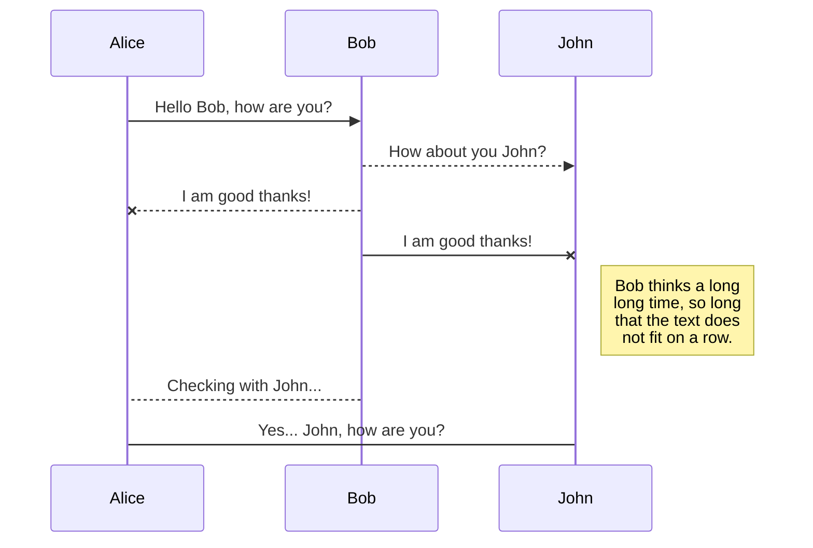

# About 
In this tutorial for C# development with ASP.NET Core, you create a C# ASP.NET Core web app in Visual Studio or Visual Studio Code.

This tutorial shows you how to:

- Create a Visual Studio project
- Create a C# ASP.NET Core web app
- Explore IDE features
- Run the web app

## Teste Treinamento
Teste

## Projects
- src/MyFirstProject.WebApp
- src/MyFirstProject.WebApi
- src/MyFirstProject.Tests

## Build Process

```
# Restore Packages
dotnet restore src/MyFirstProject.sln

# Build Solution
dotnet build src/MyFirstProject.sln --configuration Debug --no-restore

# Running Unit Tests
dotnet test src/MyFirstProject.Tests/MyFirstProject.Tests.csproj --no-build --configuration Debug --verbosity normal --logger "trx;LogFileName=test-results.trx"

# Publish WebApp
dotnet publish src/MyFirstProject.WebApp/MyFirstProject.WebApp.csproj --no-build --configuration Debug --output PublishApp

# Publish WebApi
dotnet publish src/MyFirstProject.WebApi/MyFirstProject.WebApi.csproj --no-build --configuration Debug --output PublishApi

```
## Teste Mermid


